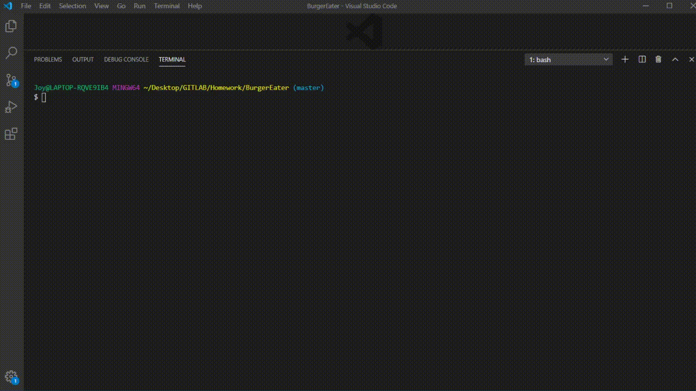

# Welcome to Burger Eater by Joy

  
  
## Description
  
This application allows the user to add burgers to a list and devour the ones they want.

## User Story

As a burger enthusiast, I want to add burgers and eat burgers, so that I feel accomplished in my burger eating abilities

  
## Table of Contents
* [Installation](#installation)
* [Usage](#usage)
* [Demo](#demo)
* [Questions](#questions)

  
## Installation

To use this application, run the following commands in your terminal to install the appropriate packages

* npm i express 
* npm i express-handlebars 
* npm i mysql

## Usage 

After you've installed the packages, 

## Demo

## Questions
  
If you see any improvements that can be made, please email me at joychen5069@gmail.com. You can also visit my GitHub page at https://github.com/joychen5069 or visit the Burger Eater page at https://github.com/joychen5069/BurgerEater

  